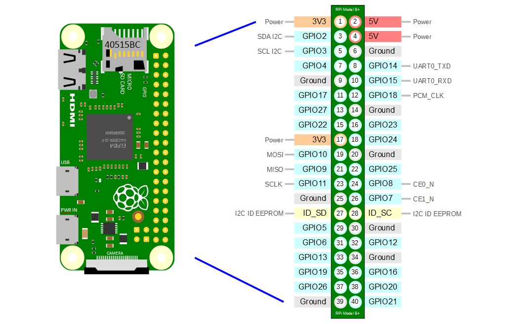

# Electronic

## Code

Need this python code to read from the DHT11 sensor

Create a file called **```read_sensor.py```** :

```python
#!/usr/bin/python
# Copyright (c) 2014 Adafruit Industries
# Author: Tony DiCola
import sys

import Adafruit_DHT

# Parse command line parameters.
sensor_args = { '11': Adafruit_DHT.DHT11,
                '22': Adafruit_DHT.DHT22,
                '2302': Adafruit_DHT.AM2302 }
if len(sys.argv) == 3 and sys.argv[1] in sensor_args:
    sensor = sensor_args[sys.argv[1]]
    pin = sys.argv[2]
else:
    print('Usage: sudo ./Adafruit_DHT.py [11|22|2302] <GPIO pin number>')
    print('Example: sudo ./Adafruit_DHT.py 2302 4 - Read from an AM2302 connected to GPIO pin #4')
    sys.exit(1)

# Try to grab a sensor reading.  Use the read_retry method which will retry up
# to 15 times to get a sensor reading (waiting 2 seconds between each retry).
humidity, temperature = Adafruit_DHT.read_retry(sensor, pin)

# Un-comment the line below to convert the temperature to Fahrenheit.
# temperature = temperature * 9/5.0 + 32

# Note that sometimes you won't get a reading and
# the results will be null (because Linux can't
# guarantee the timing of calls to read the sensor).
# If this happens try again!
if humidity is not None and temperature is not None:
    print('Temp={0:0.1f}*  Humidity={1:0.1f}%'.format(temperature, humidity))
else:
    print('Failed to get reading. Try again!')
    sys.exit(1)

```

And then, create a bash script to execute the python code above :

```bash
touch test2.bash
echo "/path/to/file/read_sensor.py 11 17" > test2.bash
```

> PS : 
>
> * 11 => DHT11
> * 17 => GPIO pin used to read data from sensor

:warning: The "api.py" AND "test2.bash" script MUST BE in the SAME folder.

---

## Electronic scheme


Based on the GPIO pinout of the raspberry pi zero (w) :

